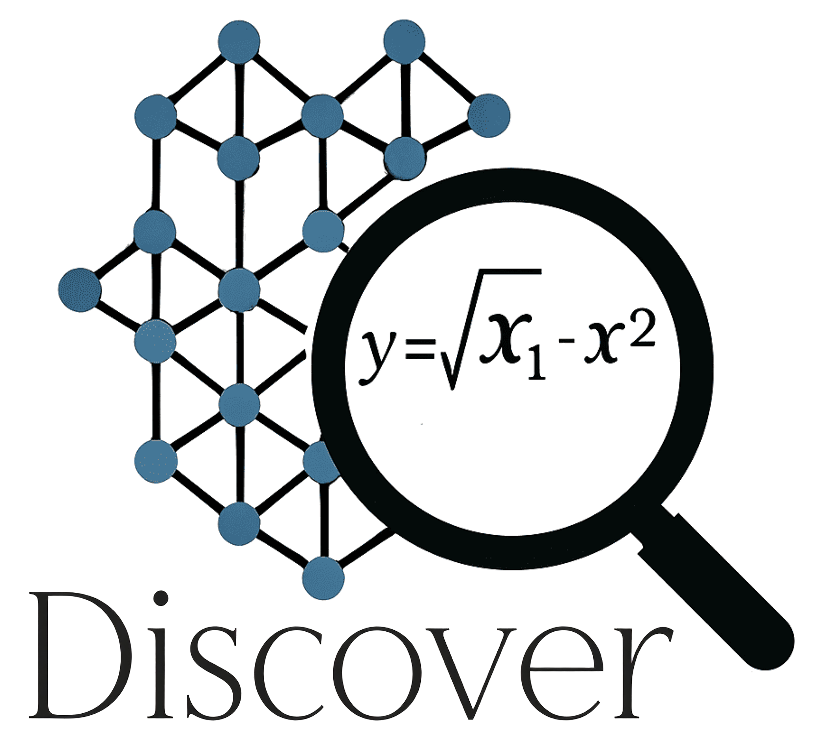

# DISCOVER: Symbolic Regression for Science

**DISCOVER** is a modern, Python-native implementation of the *Data-Informed Symbolic Combination of Operators for Variable Equation Regression* method — a powerful machine learning framework for discovering predictive, interpretable models and descriptors from large feature spaces.

This implementation is designed for **ease of use, extensibility, and performance**, incorporating modern best practices and algorithmic enhancements. This tool is ideal for **researchers and data scientists** in materials science, chemistry, and other scientific domains who need to find physically meaningful relationships in their data.

---

## Key Features

*   **Iterative Feature Generation:** Efficiently builds a high-quality feature space by iteratively generating and screening features, avoiding the combinatorial explosion of traditional methods.
*   **Multiple Search Strategies:**
    *   **Greedy & OMP:** Fast, iterative approaches for building models.
    *   **Brute-Force:** Exhaustively finds the best model for low-dimensional problems.
    *   **SISSO++:** A highly efficient, breadth-first search using QR decomposition for superior performance.
    *   **Heuristics (`rmhc`, `sa`):** Advanced search methods like Random Mutation Hill Climbing and Simulated Annealing to explore vast search spaces.
    *   **MIQP (Gurobi):** Provably finds the optimal L0-norm model for regression (requires Gurobi license).
*   **Diverse Machine Learning Tasks:**
    *   **Regression:** Linear (Ridge), Robust (Huber), and Multi-Task models.
    *   **Classification:** Logistic Regression, Support Vector Machines (SVM), and a unique Convex Hull-based classifier for geometrically separable data.
*   **GPU Acceleration:** Leverages NVIDIA (CUDA via CuPy) and Apple Silicon (MPS via PyTorch) for significant speedups in feature generation, screening, and model fitting.
*   **Unit-Aware Feature Engineering:** Uses the `pint` library to prevent the creation of physically nonsensical features by enforcing unit consistency during feature generation.
*   **Advanced Analytics & Visualization:** Includes a suite of built-in plotting methods for model interpretation, such as parity plots, classification decision boundaries, feature importance, and partial dependence plots.

---

## Navigation

- **New to DISCOVER?**
  - Start with the **[Step-by-Step Tutorial](./tutorial.md)** to run your first analysis.

- **Want to accomplish a specific task?**
  - Check out the **[How-To Guides](./howto.md)** for advanced configurations and use cases.

- **Want to contribute to the project?**
  - Read the **[Contribution Guidelines](./contribution.md)** to learn how to add new features and operators.

- **Would you like to learn fundamentals?**
  - Read the **[Fundamentals](./fundamental.md)** to learn how to add new features and operators.